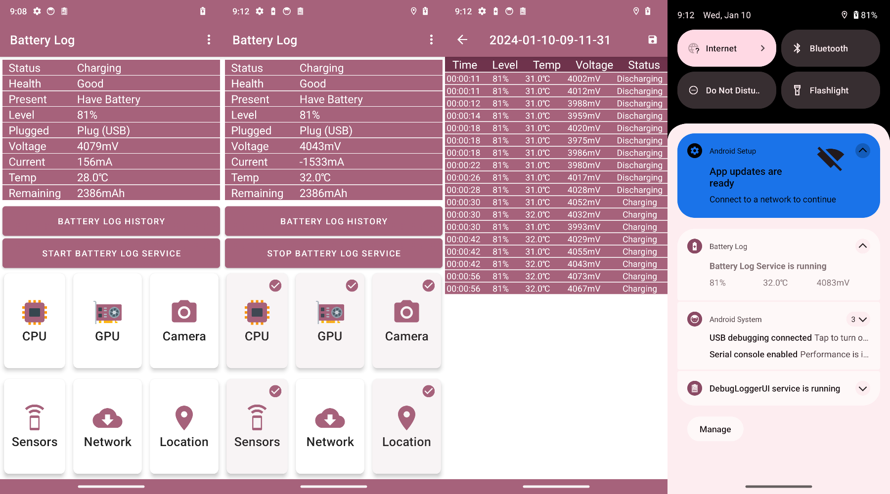

## Description of  Battery Log

Battery Log is an application that logs the information of the battery.

It also can drain battery fast.

You can check the status of the battery to manage my phone via a log that has been recorded.

Log records to prevent excessive battery level and status (charging / discharging, etc.) when a change log records.

This application supports from Android 9.0 (P) SDK 28 or higher.

If a problem occurs, please open an issue. 

Will be quick response.

## Basic Features

Battery records information.

- Your log can be viewed as a list or a graph.

- After completion of the boot log service can be started automatically.

- You can export the recorded log as CSV file via system file picker.
- Drain battery fast.
- When battery level is full, the log service will stop automatically.

## Export Logs

1. Click the save log button in the application
2. The system will open the file picker, allowing you to choose where to save the CSV file
3. Additionally, the app automatically saves a backup in DAT format to the app's private directory
4. You can also export all log files using adb command

```bash
adb pull /storage/emulated/0/Android/data/la.shiro.batterylog/files/Documents
```

## ScreenShot



